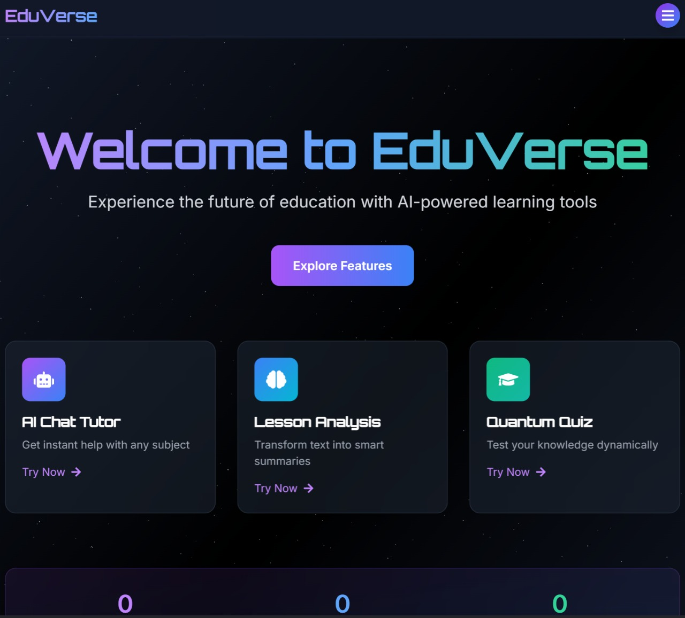

# 🚀 EduVerse AI Tutor | Hackathon Project 
*A Next-Gen Learning Platform by First-Year Students*  

 

> **Note**: This project was developed during a 24-hour hackathon period by first-year students. 🎓 While we're proud of what we've built, please expect bugs, incomplete features, and suboptimal code practices. We're learning! 🙏

## 📌 Table of Contents
- [Features](#-features)
- [Technologies Used](#-technologies-used)
- [Installation](#-installation)
- [Known Issues](#-known-issues)
- [Screenshots](#-screenshots)
- [Acknowledgments](#-acknowledgments)

## 🌟 Features
- AI-Powered Tutor Chat (GPT-3.5 Integration)
- Interactive 3D Learning Modules
- Gamified Progress Dashboard
- Responsive UI with Tailwind CSS

## 🛠 Technologies Used
- **Frontend**: React, Three.js, Tailwind CSS, Framer Motion  
- **Backend**: Node.js, Express, MongoDB  
- **AI**: Gemini API  
- **Tools**: Vite, Postman, Git  

## 💻 Installation
1. *Clone the repo*:
   ```bash
   git clone https://github.com/Ahmedgannam/Hackathon-group-project.git
   
2. ##Install dependencies*:
   ```bash
   cd frontend && npm install
   cd ../backend && npm install
   
3. ## Set up environment variables*:
   - Create .env files in /client and /server (see [.env.example](.env.example))
4. *Run the app*:
   ```bash
   # Frontend
   cd frontend && npm run dev
   # Backend
   cd backend && npm start
   

## 🐛 Known Issues
As beginners, we’re aware of several problems:  
⚠ *3D Performance*: Lag on low-end devices  
⚠ *AI Responses*: Occasional timeouts under heavy load  
⚠ *Mobile UI*: Layout breaks on small screens  

*We welcome patient contributors!* 🙌  

## 📸 Some  Screenshots

   ### Lesson Analysis Avatar
   

   ### Quiz Page
   

🙏 Thank you for exploring our project!
💡 Your curiosity fuels our journey as learners—we welcome feedback and kindness!
